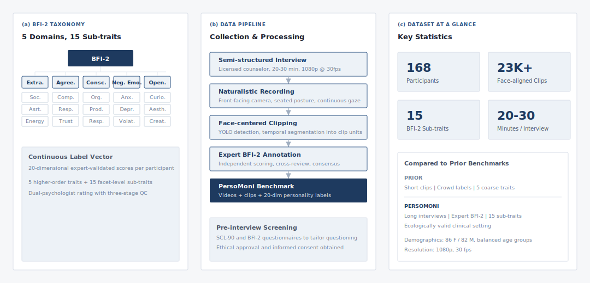

# PersoMoni

[](https://ieeexplore.ieee.org/document/11543185)
[](https://qicita.github.io/PersoMoni/)
[](https://github.com/QIcita/PersoMoni)

**PersoMoni: A Comprehensive Video-Based Benchmark Dataset for Fine-grained Personality Assessment with 15 Trait Dimensions**

Feng-Qi Cui, [Jinyang Huang](https://happyisac.github.io/PersonHomePage/)\*, Sirui Zhao, Kun Li, Zhi Liu, Meng Li, Ziyu Jia, [Dan Guo](mailto:guodan@hfut.edu.cn)\*, Meng Wang

> Published in **IEEE Transactions on Affective Computing (TAFFC)** — [IEEE Xplore](https://ieeexplore.ieee.org/document/11543185)

## Links

| Resource | Link |
|----------|------|
| **Paper** | [IEEE Xplore](https://ieeexplore.ieee.org/document/11543185) |
| **Project Page** | [English](https://qicita.github.io/PersoMoni/), [中文](https://qicita.github.io/PersoMoni/zh.html) |
| **Dataset** | [github.com/QIcita/PersoMoni](https://github.com/QIcita/PersoMoni) (coming soon) |

## News

| Date | Update |
|------|--------|
| **2026-06** | Our paper has been **accepted** and published online at *IEEE Transactions on Affective Computing* ([IEEE Xplore](https://ieeexplore.ieee.org/document/11543185), DOI: [10.1109/TAFFC.2026.3698795](https://doi.org/10.1109/TAFFC.2026.3698795)). |
| **Upcoming** | Dataset release is in preparation. See [Data Release Plan](#data-release-plan) below. |

## Data Release Plan

为保护受访者隐私，我们决定公开经通用 backbone 处理后的切片面部 feature map，而非原始视频。如果您需要原始完整采访长视频，请关注我们后续的申请信息。

> **Privacy notice:** To protect participant privacy, we will release **facial feature maps** extracted from clips using a **general-purpose backbone**, rather than the raw interview videos. If you need access to the original full-length interview videos, please follow our upcoming application announcement.

The release will include BFI-2 annotations and processed visual features to support academic research on fine-grained personality computing.

## Overview

PersoMoni is a clinically grounded benchmark for fine-grained, temporally rich personality computing. The dataset contains **168** full-length psychological interviews conducted by licensed counselors, producing over **20,000** aligned facial video segments. Each participant is annotated using the full **BFI-2** taxonomy, providing continuous labels for five major traits and **fifteen validated sub-traits**, the first benchmark to extend personality granularity from 5 to 15 dimensions.

<p align="center">
  
</p>

## Key Features

- **Long-horizon naturalistic interaction** - ~25 min avg. semi-structured interviews with licensed counselors
- **Expert-validated BFI-2 labels** - dual professional rating with three-stage quality control
- **Fine-grained trait structure** - 5 Big Five domains + 15 BFI-2 sub-traits (20-dim continuous vector)
- **Face-centered clip corpus** - 20,000+ 1080p segments for temporal modeling
- **Privacy-aware release** - feature maps instead of raw videos

## Dataset Statistics

| Property | Value |
|----------|-------|
| Participants | 168 (86 F / 82 M) |
| Video clips | 20,000+ |
| Interview duration | ~25 min avg. |
| Resolution | 1080p @ 30 fps |
| Label space | 20-dim BFI-2 continuous scores |

## Getting Started

Dataset materials will be released in this repository. Please watch this repo for updates.

```bash
git clone https://github.com/QIcita/PersoMoni.git
cd PersoMoni
```

## Citation

If you find PersoMoni useful in your research, please cite:

```bibtex
@article{cui2026persomoni,
  author  = {Cui, Feng-Qi and Huang, Jinyang and Zhao, Sirui and Li, Kun and Liu, Zhi and Li, Meng and Jia, Ziyu and Guo, Dan and Wang, Meng},
  journal = {IEEE Transactions on Affective Computing},
  title   = {PersoMoni: A Comprehensive Video-Based Benchmark Dataset for Fine-grained Personality Assessment with 15 Trait Dimensions},
  year    = {2026},
  pages   = {1--14},
  doi     = {10.1109/TAFFC.2026.3698795},
  url     = {https://ieeexplore.ieee.org/document/11543185}
}
```

## Acknowledgments

This work was supported by the [Anhui Province Key Laboratory of Affective Computing and Advanced Intelligent Machine](https://aflab.hfut.edu.cn/), Hefei University of Technology.

## License

The dataset is released for academic research purposes. Please refer to the repository for license details upon release.
